# SEA Salon
> Website of SEA Salon.

## Table of Contents
* [General Info](#general-information)
* [Deployment Link](#deployment_link)
* [Technologies Used](#technologies-used)
* [Features](#features)
* [Screenshots](#screenshots)
* [Setup](#setup)
* [Usage](#usage)
* [Project Status](#project-status)
* [Room for Improvement](#room-for-improvement)
* [Contributor](#contributor)

## General Information
- This project is made to fulfill Compfest 16 Software Engineering Academy submission.

## Deployment Link
https://sea-salon-seven.vercel.app/

## Technologies Used
- Remix -version 2.9.2
- React -version 18.2.0
- Swiper -version 11.1.4
- Tailwind CSS -version 3.4.4
- Typescript -version 5.1.6
- Vite -version 5.1.0
- Node -version 21.6.2
- dotenv - version 16.4.5
- firebase -version 10.12.2
- firebase-admin -version 12.2.0

## Features
- Home Page
- Reviews sorted by rating
- Review Form
- Reservation Page
- Reservation Form -- Integrated with each branch
- Reservation list sorted by latest date
- User Authentication (Sign Up/Login/Logout)
- Profile Page
- Add Service Form
- Add Branch Form
- Responsive

## Screenshots

### Desktop - Home Page

### Desktop - Sign Up

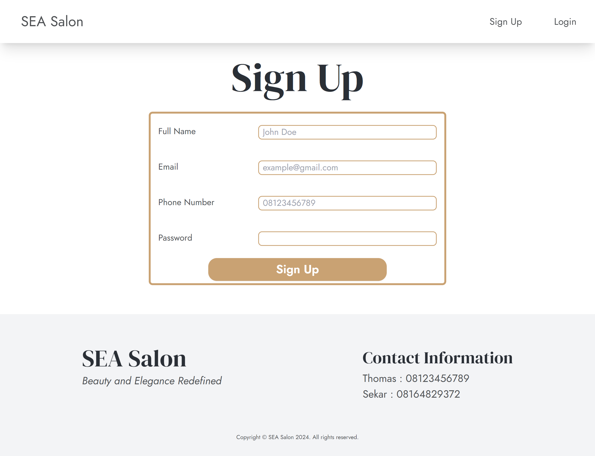

### Desktop - Login

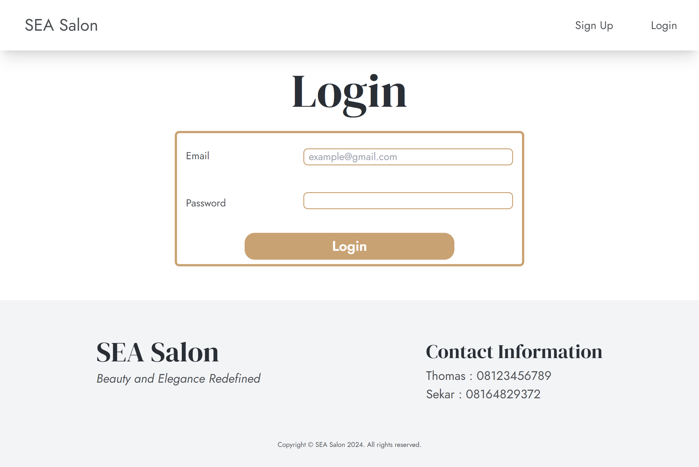

### Desktop - Profile

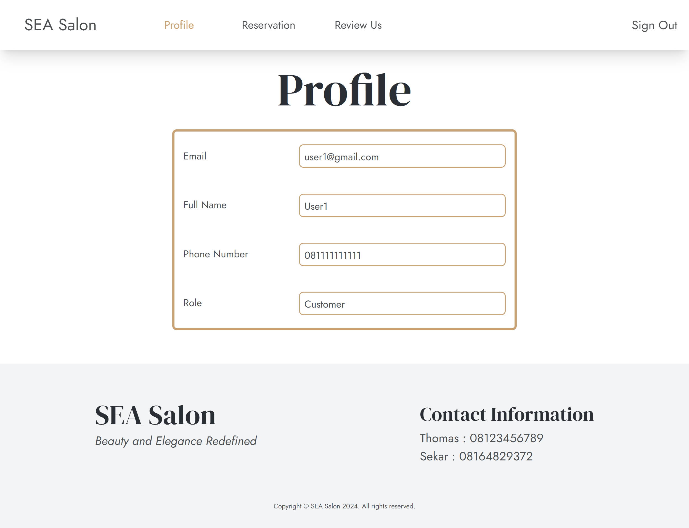

### Desktop - Service

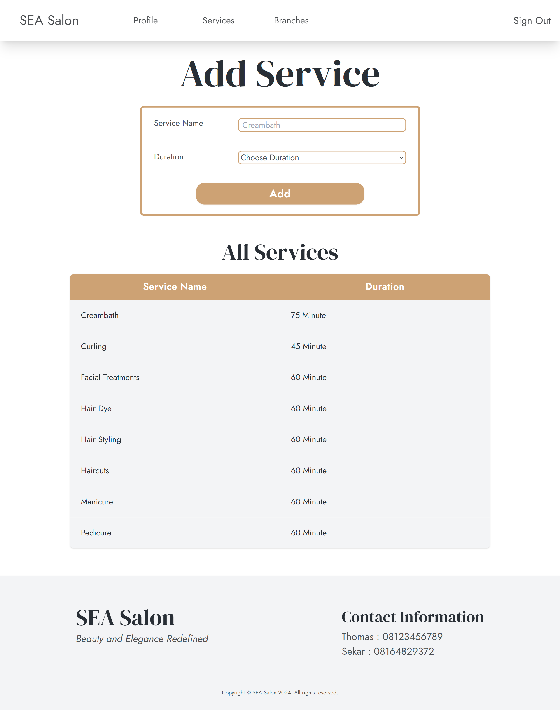

### Desktop - Branch

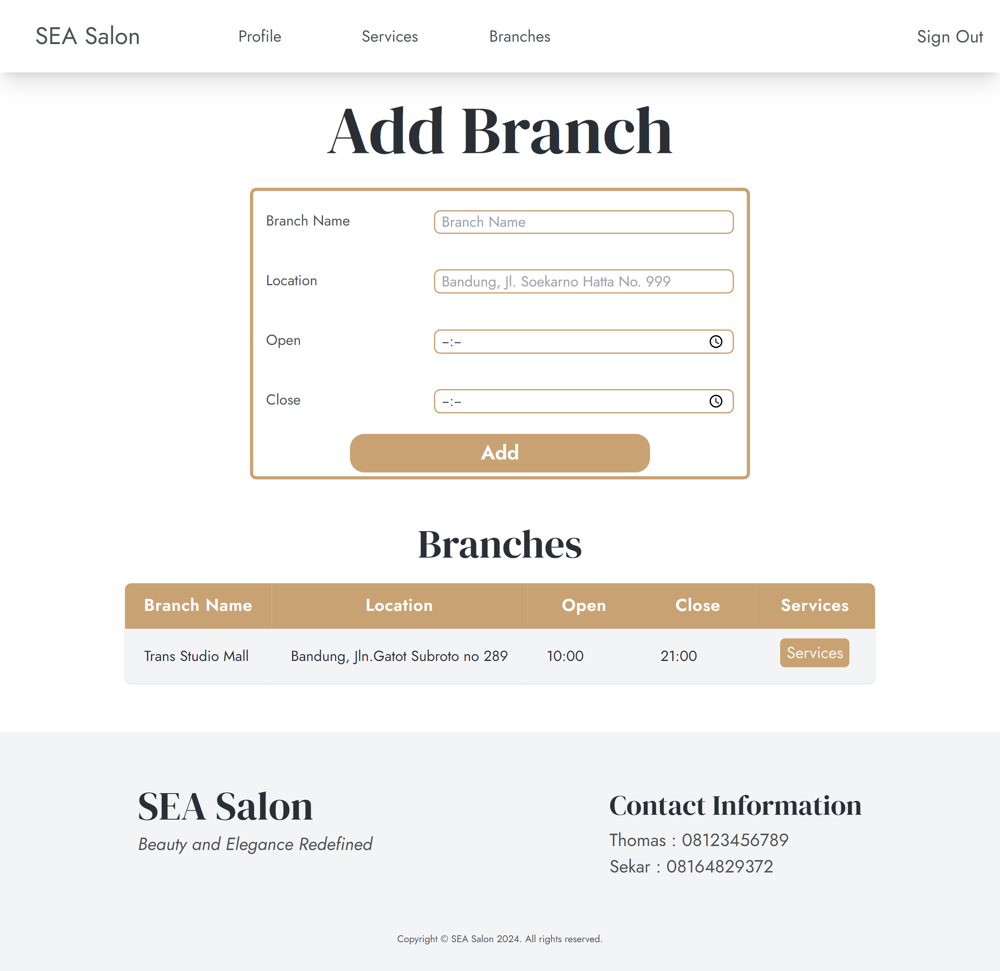

### Desktop - Branch Details

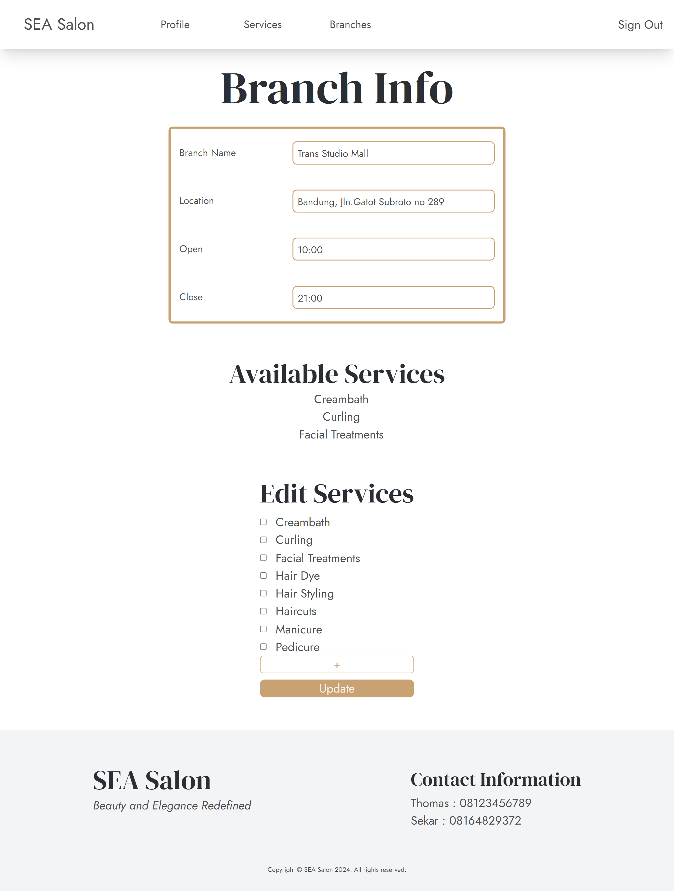

### Desktop - Reservation

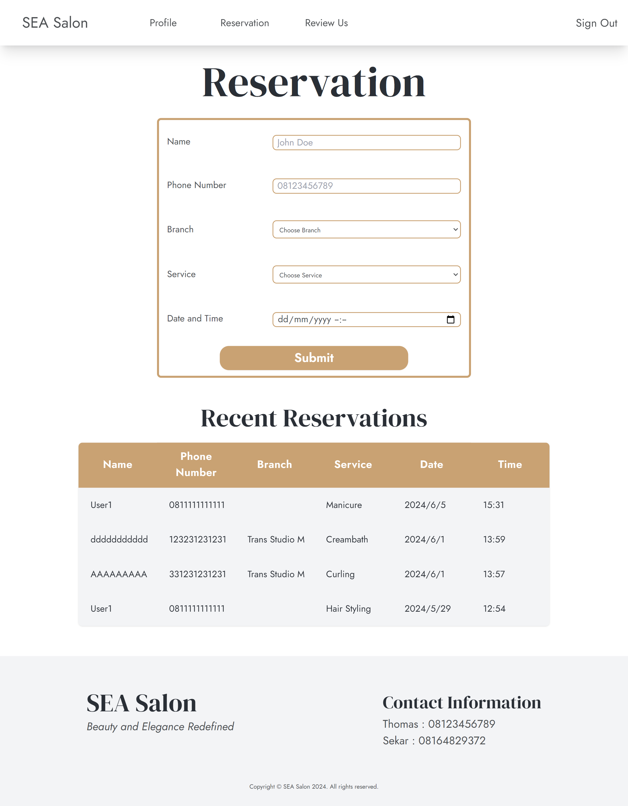

### Desktop - Review

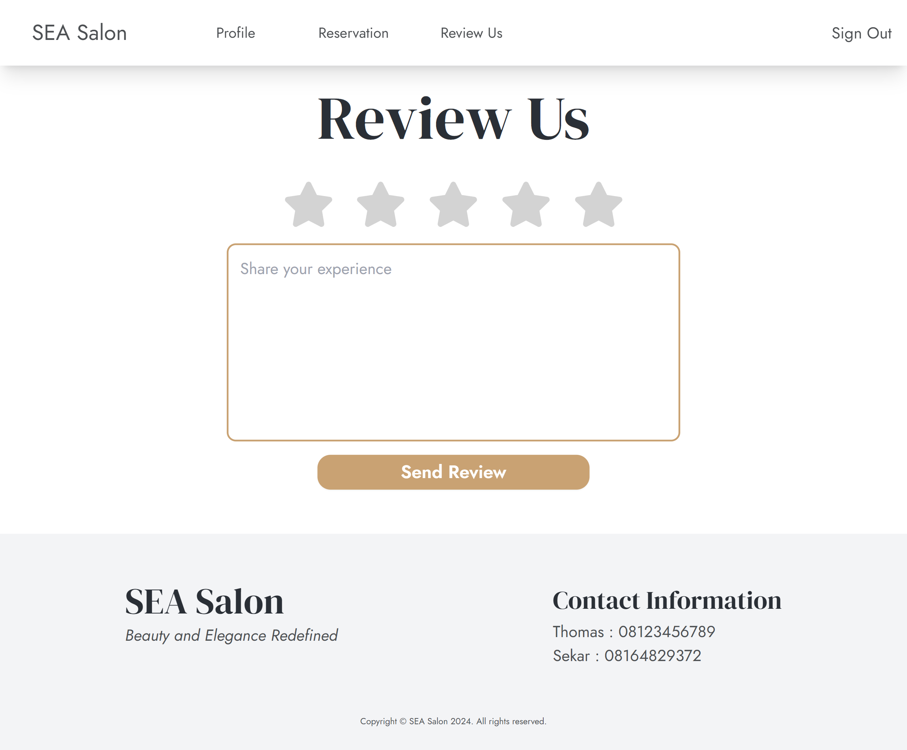

### Mobile - Home Page

### Mobile - SignUp

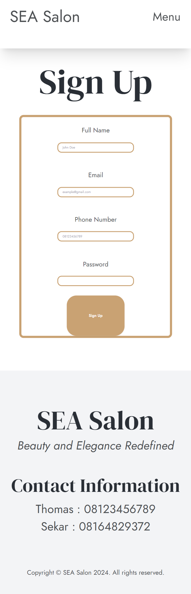

### Mobile - Login

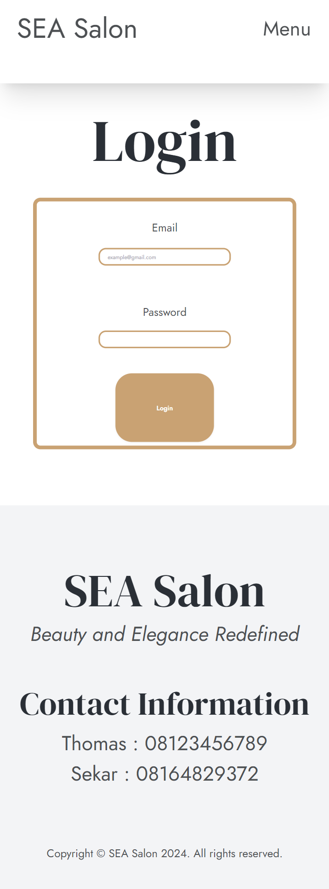

### Mobile - Profile

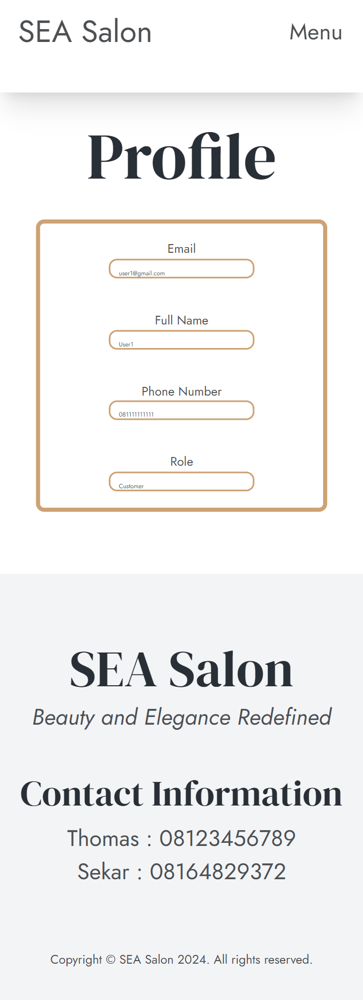

### Mobile - Service

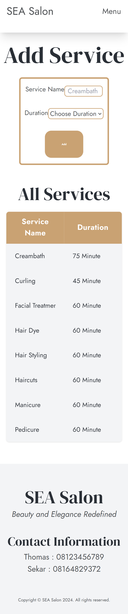

### Mobile - Branch

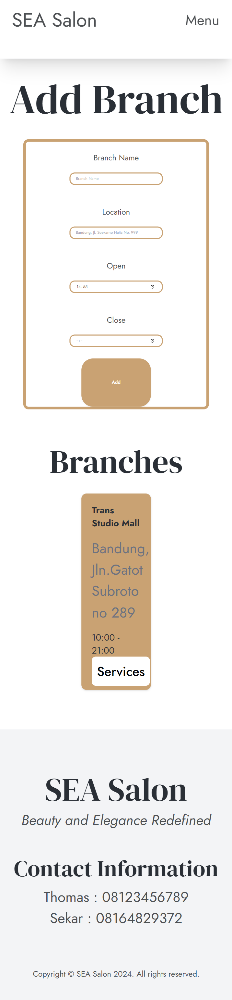

### Mobile - Branch Details

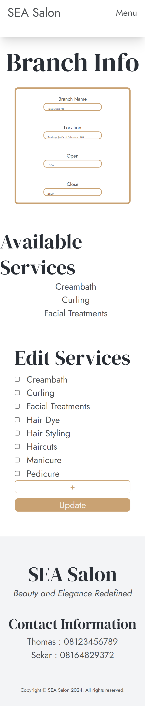

### Mobile - Reservation

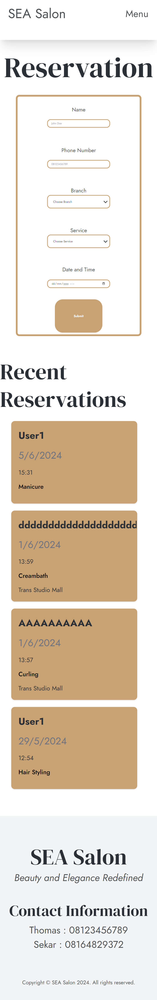

### Mobile - Review

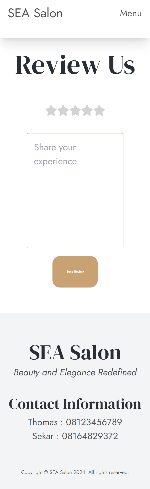

## Setup

These steps assume that you have installed Node.js already

1. From SEA_Salon, navigate to "app" directory.

    `cd src/app`

2. Install dependencies.

    `npm install`

3. Run program.

    `npm run dev`

4. Navigate to the localhost shown.

## Usage
1. See general information and services.
2. See reviews.
3. Add/update review.
4. Add Reservation(s).
5. See Reservation(s).
6. Sign Up/Login/Logout
7. Add Service(s).
8. See Service(s).
9. Add Branch(es).
10. See Branch(es).
11. Assign Service(s) into Branch(es).

## Project Status
Project is: _finished_.

## Room for Improvement
- Scrollreveal.
- Reservation list pagination.
- Reservation schedule integration.
- Show/hide password field.
- Improved UI for mobile.
- Upload image for Service's image.
- Loading notification/animations.
- On Failure/Success advanced notification Form submission.

## Contributor
> Steven Tjhia 

## Licenses
- www.freepik.com
- www.pinterest.com