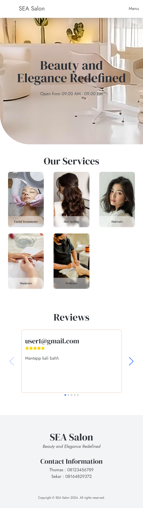

# SEA Salon
> Website of SEA Salon.

## Table of Contents
* [General Info](#general-information)
* [Technologies Used](#technologies-used)
* [Features](#features)
* [Screenshots](#screenshots)
* [Setup](#setup)
* [Usage](#usage)
* [Project Status](#project-status)
* [Room for Improvement](#room-for-improvement)
* [Contributor](#contributor)

## General Information
- This project is made to fulfill Compfest 16 Software Engineering Academy submission.

## Technologies Used
- Remix -version 2.9.2
- React -version 18.2.0
- Swiper -version 11.1.4
- Tailwind CSS -version 3.4.4
- Typescript -version 5.1.6
- Vite -version 5.1.0
- Node -version 21.6.2
- dotenv - version 16.4.5
- firebase -version 10.12.2
- firebase-admin -version 12.2.0

## Features
- Home Page
- Reviews sorted by rating
- Review Form
- Reservation Page
- Reservation Form
- Reservation list sorted by latest date
- User Authentication (Sign Up/Login/Logout)
- Profile Page
- Service Form

## Screenshots

### Desktop - Home Page

### Desktop - Sign Up

### Desktop - Login

### Desktop - Profile

### Desktop - Service

### Desktop - Reservation

### Desktop - Review

### Mobile - Home Page

### Mobile - SignUp

### Mobile - Login

### Mobile - Profile

### Mobile - Service

### Mobile - Reservation

### Mobile - Review

## Setup

These steps assume that you have installed Node.js already

1. From SEA_Salon, navigate to "app" directory.

    `cd src/app`

2. Install dependencies.

    `npm install`

3. Run program.

    `npm run dev`

4. Navigate to the localhost shown.

## Usage
1. See general information and services.
2. See reviews.
3. Add/update review.
4. Add Reservation(s).
5. See Reservation(s).
6. Sign Up/Login/Logout
7. Add Service(s).

## Project Status
Project is: _on-progress_.

## Room for Improvement
- Scrollreveal
- Reservation list pagination

## Contributor
> Steven Tjhia 

## Licenses
- www.freepik.com
- www.pinterest.com